# IT Asset Manager

IT 자산을 등록하고 상태를 관리할 수 있는 웹 기반 자산 관리 시스템입니다.

---

## 기술 스택

- HTML
- CSS
- JavaScript

---

## 개발 진행 상황

### Day 1 - 자산 관리 기본 기능 구현

### 1. 자산 관리 메인 화면

HTML과 CSS를 활용하여 IT 자산 관리 시스템의 기본 화면을 구현했습니다.

상단 대시보드에서 전체 자산 수와 상태별 자산 수를 확인할 수 있으며,
자산 등록과 등록된 자산 목록을 한 화면에서 관리할 수 있도록 구성했습니다.

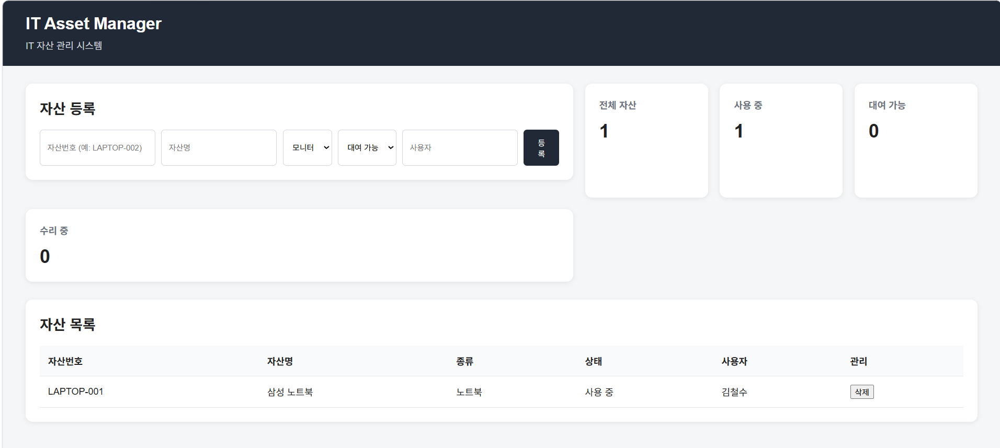

---

### 2. 자산 등록 기능

자산번호, 자산명, 종류, 상태, 사용자를 입력하여
새로운 IT 자산을 등록할 수 있도록 구현했습니다.

자산번호와 자산명은 필수 입력값으로 설정했으며,
동일한 자산번호가 이미 존재하는 경우 중복 등록을 방지하도록 구현했습니다.

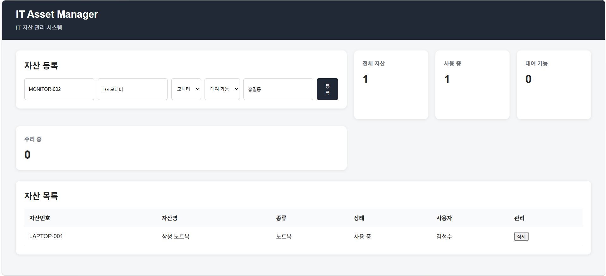

---

### 3. 자산 등록 및 대시보드 자동 갱신

새로운 자산을 등록하면 자산 목록에 즉시 추가되며,
등록된 자산의 상태에 따라 대시보드의 자산 수도 자동으로 갱신됩니다.

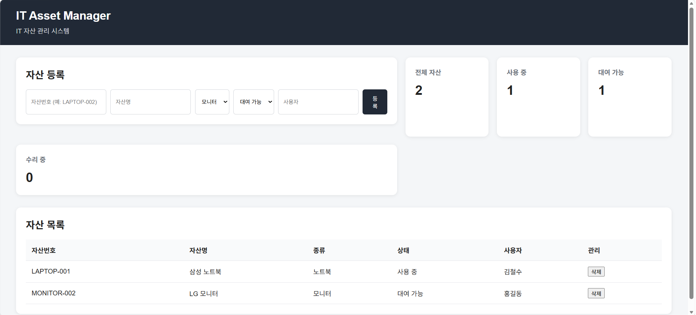

---

### 4. 자산 삭제 기능

등록된 자산의 삭제 버튼을 통해 자산을 삭제할 수 있도록 구현했습니다.

자산 삭제 후에는 자산 목록과 대시보드의 자산 수도 함께 갱신됩니다.

---

## Day 1 구현 기능

- IT 자산 관리 기본 UI
- 자산 목록 조회
- 신규 자산 등록
- 필수 입력값 검증
- 자산번호 중복 등록 방지
- 자산 삭제
- 상태별 자산 수 계산
- 등록 및 삭제 시 화면 자동 갱신

---

## 프로젝트 구조

```text
it_asset_manager/
│
├── frontend/
│   ├── index.html
│   ├── style.css
│   └── app.js
│
├── result/
│   ├── day1.png
│   ├── day1_2.png
│   └── day1_3.png
│
└── README.md
```

---


### Day 2 - 자산 관리 기능 개선

Day 1에서 구현한 기본 자산 관리 기능을 기반으로
자산 수정, 검색, 상태 필터링 및 데이터 저장 기능을 추가했습니다.

또한 자산 관리 과정에서 사용자가 실수로 데이터를 삭제하는 것을 방지하기 위해
삭제 확인 기능을 추가하고 검색 및 관리 영역의 UI를 개선했습니다.

---

### 1. 자산 수정 기능

등록된 자산의 정보를 수정할 수 있도록 기능을 추가했습니다.

수정 버튼을 선택하면 기존 자산 정보가 입력창에 자동으로 표시되며,
수정 중에는 등록 버튼이 `수정 저장`으로 변경되도록 구현했습니다.

수정이 완료되면 변경된 자산 정보와 대시보드의 상태별 자산 수가
자동으로 갱신됩니다.

---

### 2. 자산 검색 기능

등록된 자산을 빠르게 찾을 수 있도록 실시간 검색 기능을 구현했습니다.

다음 정보를 기준으로 검색할 수 있습니다.

- 자산번호
- 자산명
- 자산 종류
- 사용자

검색어를 입력하면 조건에 해당하는 자산만
실시간으로 자산 목록에 표시됩니다.

---

### 3. 상태별 자산 필터링

자산의 현재 상태에 따라 필요한 자산만 확인할 수 있도록
상태 필터 기능을 추가했습니다.

지원하는 상태는 다음과 같습니다.

- 전체 상태
- 대여 가능
- 사용 중
- 수리 중

검색 기능과 상태 필터를 동시에 적용할 수 있도록 구현하여
보다 쉽게 원하는 자산을 찾을 수 있도록 개선했습니다.

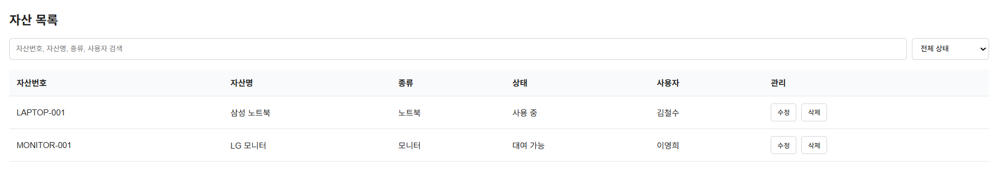

---

### 4. LocalStorage를 활용한 데이터 유지

기존에는 브라우저를 새로고침하면 새롭게 등록하거나 수정한 자산 정보가
초기화되는 문제가 있었습니다.

브라우저의 LocalStorage를 활용하여 자산 데이터를 저장하도록 개선했으며,
자산 등록, 수정, 삭제가 발생할 때마다 변경된 데이터를 자동으로 저장하도록 구현했습니다.

이를 통해 페이지를 새로고침하더라도
사용자가 관리한 자산 정보가 유지됩니다.

---

### 5. 자산 삭제 확인 기능

삭제 버튼을 잘못 선택하여 자산이 즉시 삭제되는 것을 방지하기 위해
삭제 전 확인 과정을 추가했습니다.

사용자가 삭제 버튼을 선택하면 삭제 여부를 확인하고,
확인을 선택한 경우에만 해당 자산이 삭제되도록 구현했습니다.

삭제된 결과는 LocalStorage에도 반영되어
페이지를 새로고침한 이후에도 삭제 상태가 유지됩니다.

---

### 6. UI 개선

새롭게 추가된 검색 기능과 상태 필터가
기존 자산 관리 화면과 자연스럽게 구성되도록 UI를 개선했습니다.

검색창과 상태 필터를 한 영역에 배치하고,
수정 및 삭제 버튼의 스타일을 정리하여 자산 관리 화면의 가독성을 높였습니다.

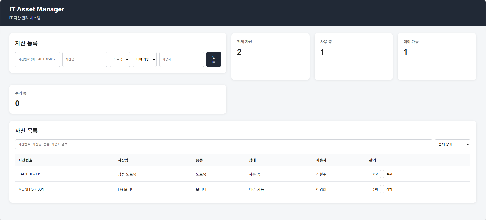

---

## Day 2 구현 기능

- 자산 정보 수정
- 수정 모드 및 수정 저장 기능
- 자산 실시간 검색
- 상태별 자산 필터링
- 검색 및 상태 필터 동시 적용
- LocalStorage 기반 자산 데이터 저장
- 새로고침 후 데이터 유지
- 자산 삭제 확인
- 검색 및 관리 영역 UI 개선


---

### Day 3 - 자산 대여 및 반납 관리 기능 구현

Day 2에서 구현한 자산 관리 기능을 기반으로
자산 대여, 반납, 대여 이력 관리 및 반납 예정일 관리 기능을 추가했습니다.

사용자가 자산을 대여할 때 대여자와 반납 예정일을 입력할 수 있도록 구현했으며,
대여 및 반납 과정에서 발생하는 기록을 대여 이력으로 관리할 수 있도록 개선했습니다.

또한 반납 예정일을 기준으로 반납 예정 및 반납 지연 상태를 자동으로 확인하고
대시보드에서 해당 자산의 개수를 확인할 수 있도록 구현했습니다.

---

### 1. 자산 대여 기능

대여 가능한 자산을 선택하여 자산을 대여할 수 있도록 기능을 추가했습니다.

대여 버튼을 선택하면 대여할 사용자를 입력할 수 있는 창이 표시되며,
사용자 정보를 입력하여 해당 자산을 대여할 수 있도록 구현했습니다.

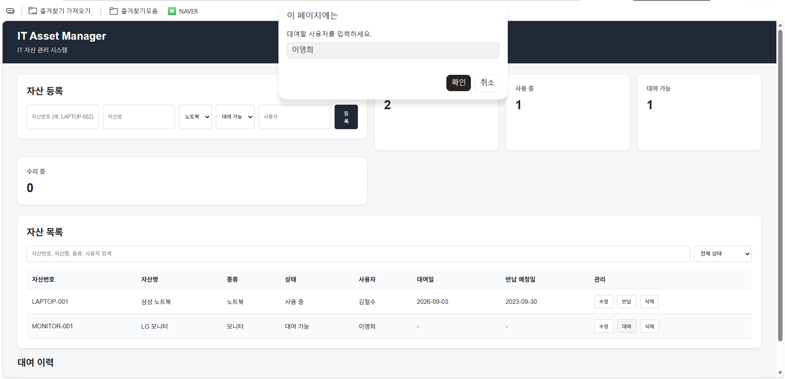

---

### 2. 반납 예정일 입력 기능

자산을 대여할 때 반납 예정일을 함께 입력할 수 있도록 구현했습니다.

대여할 사용자를 입력한 후 반납 예정일을 선택할 수 있으며,
입력된 반납 예정일을 기준으로 자산의 대여 기간을 관리할 수 있도록 구성했습니다.


---

### 3. 대여 정보 표시

대여 사용자와 반납 예정일 입력이 완료되면
해당 자산의 상태가 `사용 중`으로 변경됩니다.

또한 자산 목록에서 대여자, 대여일, 반납 예정일을 확인할 수 있도록 구현했습니다.

이를 통해 현재 어떤 사용자가 자산을 대여하고 있는지와
언제까지 반납해야 하는지를 한눈에 확인할 수 있습니다.

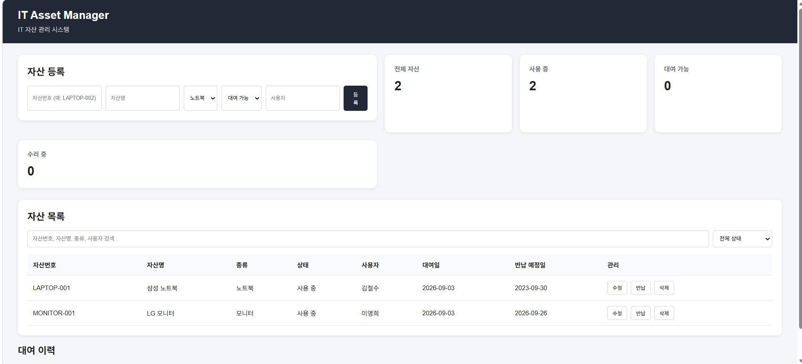

---

### 4. 자산 반납 및 대여 이력 관리

대여 중인 자산을 반납할 수 있도록 반납 기능을 추가했습니다.

자산을 반납하면 현재 대여 정보가 초기화되고
자산 상태가 다시 `대여 가능`으로 변경됩니다.

또한 자산의 대여 및 반납 정보를 대여 이력으로 별도로 저장하여
과거에 해당 자산을 누가 대여했는지 확인할 수 있도록 구현했습니다.

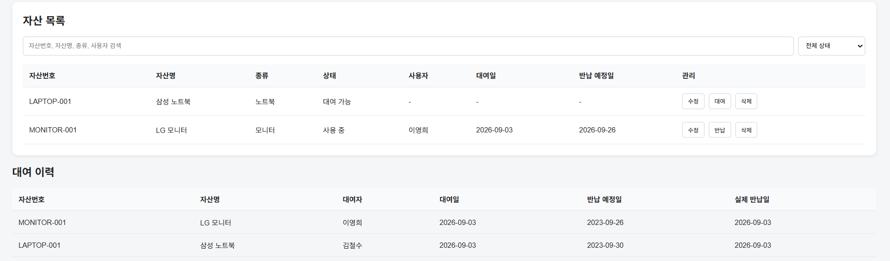

---

### 5. 반납 예정 및 반납 지연 상태 관리

자산의 반납 예정일을 기준으로 대여 상태를 자동으로 확인하도록 구현했습니다.

반납 예정일까지 3일 이하로 남은 자산은
`반납 예정` 상태로 표시됩니다.

반납 예정일이 지난 자산은
`⚠ 반납 지연` 상태로 표시됩니다.

또한 대시보드에서 반납 예정 및 반납 지연 자산의 개수를
각각 확인할 수 있도록 기능을 추가했습니다.

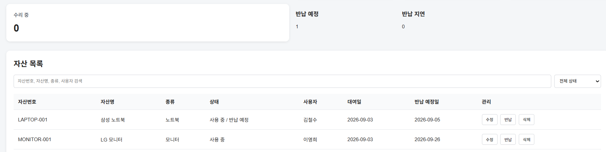

---

## Day 3 구현 기능

- 자산 대여 기능
- 대여 사용자 입력
- 반납 예정일 입력
- 대여자 및 대여일 표시
- 반납 예정일 표시
- 자산 반납 기능
- 대여 이력 관리
- 실제 반납일 기록
- 반납 예정 상태 표시
- 반납 지연 상태 표시
- 반납 예정 및 반납 지연 자산 수 계산
- 대시보드 반납 상태 표시
- LocalStorage 기반 대여 데이터 유지


### Day 4 - 자산 상세 조회 기능 구현

Day 3에서 구현한 자산 대여 및 반납 관리 기능을 기반으로
자산 상세 조회 및 대여 이력 확인 기능을 추가했습니다.

사용자가 자산 목록에서 상세 버튼을 선택하면 해당 자산의 상세 정보를 확인할 수 있도록 구현했으며,

자산의 기본 정보와 현재 대여 상태 및 대여 이력을 한눈에 확인할 수 있도록 개선했습니다.

또한 별도의 모달 창을 통해 자산 정보를 표시하여

자산 목록 화면을 이동하지 않고도 상세 정보를 확인할 수 있도록 구현했습니다.

#### 실행 결과

### 1. 자산 상세 정보 확인

상세 버튼을 클릭하면 해당 자산의 상세 정보가 모달 형태로 표시되도록 구현하였다.

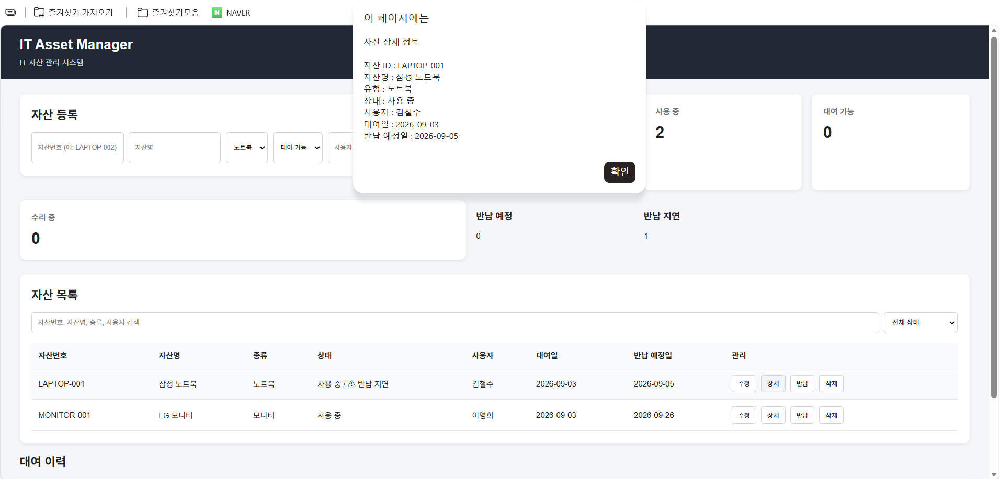

자산 ID, 자산명, 유형, 상태, 사용자, 대여일, 반납 예정일 등의 정보를 확인할 수 있다.


### 2. 대여 이력 확인

자산의 상세 정보와 함께 해당 자산의 대여 이력을 확인할 수 있도록 구현하였다.

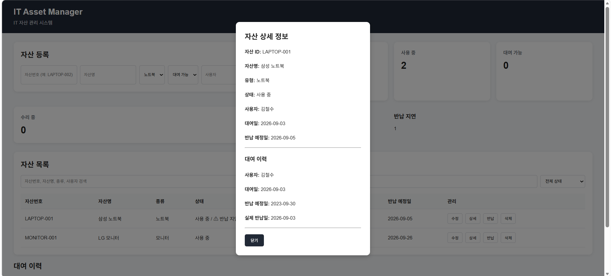

대여 사용자, 대여일, 반납 예정일, 실제 반납일 등의 대여 이력을 확인할 수 있다.

### Day 4 구현기능
- 자산 상세 조회 기능 추가
- 상세 버튼을 통해 개별 자산의 상세 정보 확인
- 자산 ID, 자산명, 유형, 상태, 사용자, 대여일, 반납 예정일 표시
- 해당 자산의 대여 이력 조회
- 대여 사용자, 대여일, 반납 예정일, 실제 반납일 표시
- 모달(Modal) UI를 활용한 상세 정보 표시


### Day 5 - CSV 데이터 관리 및 대여 이력 검색 기능 구현

Day 4에서 구현한 자산 상세 조회 기능을 기반으로

자산 데이터를 파일 형태로 관리할 수 있도록 CSV 내보내기 및 가져오기 기능을 추가했습니다.

또한 대여 이력이 많아졌을 때 원하는 기록을 빠르게 찾을 수 있도록

대여 이력 검색 기능을 추가했습니다.

CSV 기능을 통해 현재 자산 데이터를 파일로 저장하거나

기존 CSV 파일의 자산 데이터를 시스템으로 불러올 수 있도록 개선했으며,

대여 이력 검색 기능을 통해 자산번호, 자산명 및 대여자를 기준으로

원하는 대여 기록을 실시간으로 검색할 수 있도록 구현했습니다.

---

### 1. CSV 자산 데이터 내보내기

자산 목록에서 관리 중인 데이터를 CSV 파일로 내보낼 수 있도록

`CSV 내보내기` 버튼을 추가했습니다.

버튼을 선택하면 현재 등록된 자산 정보가

CSV 파일 형태로 생성되어 다운로드되도록 구현했습니다.

이를 통해 시스템에서 관리하는 자산 데이터를

별도의 파일로 저장하고 활용할 수 있도록 개선했습니다.

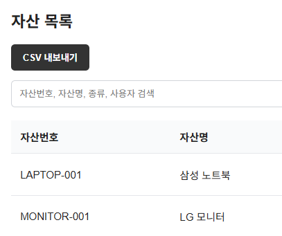

---

### 2. CSV 파일 다운로드

CSV 내보내기 기능을 실행하면

`it_asset_list.csv` 파일이 생성되어 다운로드됩니다.

다운로드된 CSV 파일을 통해 자산번호, 자산명, 종류, 상태,

사용자, 대여일 및 반납 예정일 등의 자산 정보를 확인할 수 있습니다.

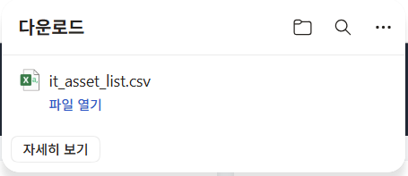

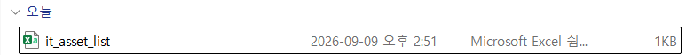

---

### 3. CSV 자산 데이터 가져오기

외부에서 관리하거나 이전에 저장한 CSV 파일을

시스템으로 불러올 수 있도록 `파일 선택` 기능을 추가했습니다.

사용자가 CSV 파일을 선택하면 파일의 자산 데이터를 읽어와

현재 자산 목록에 반영하도록 구현했습니다.

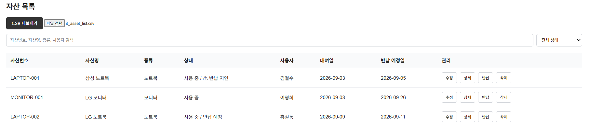

---

### 4. CSV 파일 불러오기 결과

CSV 파일을 선택하면 파일의 데이터를 읽어온 후

LocalStorage에 저장하고 자산 목록과 대시보드를 자동으로 갱신하도록 구현했습니다.

파일을 정상적으로 불러오면 확인 메시지를 표시하여

사용자가 CSV 데이터가 정상적으로 적용되었는지 확인할 수 있도록 구성했습니다.

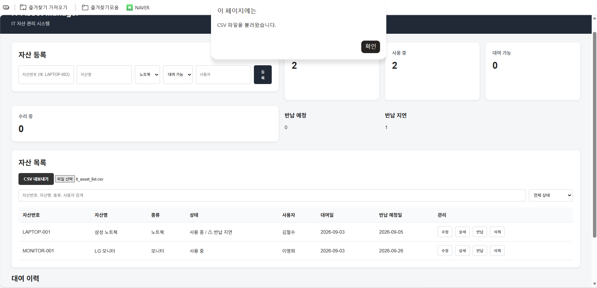

---

### 5. 대여 이력 검색 기능

대여 이력을 빠르게 찾을 수 있도록

대여 이력 영역에 검색창을 추가했습니다.

검색창을 통해 자산번호, 자산명 및 대여자를 기준으로

대여 이력을 검색할 수 있도록 구현했습니다.

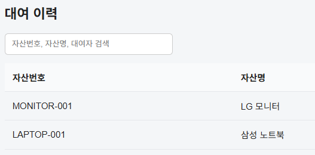

---

### 6. 대여자 기준 검색

검색창에 대여자의 이름을 입력하면

해당 사용자의 대여 이력만 표시되도록 구현했습니다.

예를 들어 `김철수`를 입력하면

김철수가 대여했던 자산의 이력을 확인할 수 있습니다.

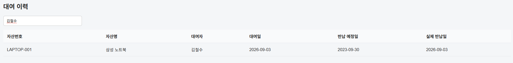

---

### 7. 자산명 기준 검색

자산명으로도 대여 이력을 검색할 수 있도록 구현했습니다.

예를 들어 `모니터`를 입력하면

자산명에 `모니터`가 포함된 대여 이력만 표시됩니다.

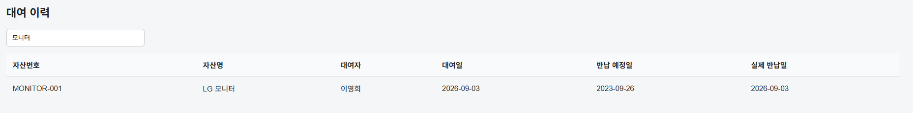

---

### 8. 자산번호 기준 검색

자산번호를 기준으로도 대여 이력을 검색할 수 있도록 구현했습니다.

자산번호 전체를 입력하지 않아도

`001`과 같이 자산번호의 일부만 입력하여

해당 번호가 포함된 대여 이력을 찾을 수 있도록 구현했습니다.

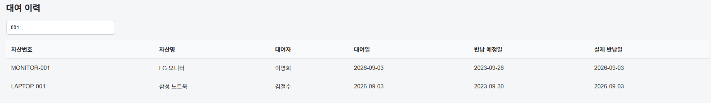

---

## Day 5 구현 기능

- CSV 자산 데이터 내보내기
- CSV 파일 다운로드
- CSV 자산 데이터 가져오기
- CSV 파일 선택 기능
- CSV 데이터 LocalStorage 저장
- CSV 데이터 불러오기 후 화면 자동 갱신
- CSV 불러오기 완료 메시지
- 대여 이력 검색 기능
- 대여자 기준 검색
- 자산명 기준 검색
- 자산번호 기준 검색
- 검색어 일부 입력을 통한 대여 이력 검색
- 실시간 대여 이력 필터링

### Day 6 - 자산 상태 관리 기능 강화

Day 5에서 구현한 자산 관리 및 대여 이력 검색 기능을 기반으로

자산 상태 변경 과정에서 발생할 수 있는 데이터 불일치를 방지하기 위한 기능을 추가했습니다.

대여 중인 자산의 상태를 임의로 변경할 수 없도록 제한했으며,

대여 기능을 거치지 않고 자산 상태를 `사용 중`으로 변경하는 것도 제한했습니다.

이를 통해 자산의 상태가 실제 대여 및 반납 과정과 일치하도록 개선했습니다.


#### 1. 대여 중인 자산 상태 변경 제한

현재 `사용 중`인 자산은 반납하기 전까지

`대여 가능` 또는 `수리 중` 상태로 직접 변경할 수 없도록 구현했습니다.

대여 중인 자산의 상태를 변경하려고 하면

안내 메시지를 표시하고 상태 변경을 차단합니다.

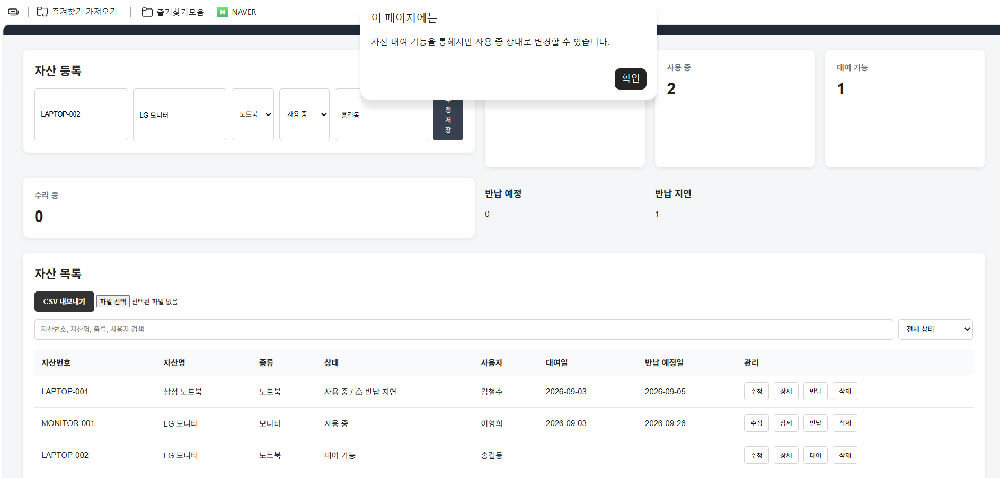


#### 3. 수리 중인 자산 대여 방지

수리 중인 자산이 대여되는 것을 방지하기 위해

대여 기능에서도 자산의 상태를 확인하도록 구현했습니다.

자산 상태가 `수리 중`인 경우 대여를 차단하고

사용자에게 안내 메시지를 표시합니다.


#### 구현 내용

- 대여 중인 자산의 상태 변경 제한
- `사용 중` 상태 직접 변경 제한
- 대여 기능을 통한 `사용 중` 상태 관리
- 수리 중인 자산 대여 방지
- 자산 상태와 대여/반납 기능 간 데이터 일관성 개선

### Day 7 - 자산 삭제 및 대여 이력 관리 개선

Day 6에서 구현한 자산 상태 관리 기능을 기반으로

자산 삭제 및 대여 이력 관리 기능을 개선했습니다.

대여 이력이 존재하는 자산을 삭제할 경우

사용자에게 대여 이력 보존 여부를 안내하고,

자산이 삭제된 이후에도 기존 대여 이력을 확인할 수 있도록 개선했습니다.

또한 자산 대여 시 대여 이력이 즉시 생성되도록 수정하고,

반납 시 기존 대여 이력에 실제 반납 날짜를 기록하도록 개선했습니다.


#### 1. 대여 이력이 있는 자산 삭제 확인

대여 이력이 존재하는 자산을 삭제할 경우

사용자에게 대여 이력과 관련된 안내 메시지를 표시하도록 구현했습니다.

이를 통해 대여 기록이 존재하는 자산을 실수로 삭제하는 상황을 방지하고

사용자가 삭제 여부를 직접 확인할 수 있도록 개선했습니다.

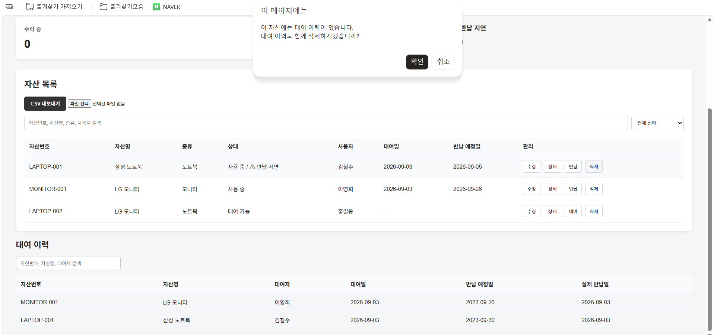


#### 2. 자산 삭제 후 대여 이력 보존

자산 삭제 시 기존 대여 이력을 함께 삭제하지 않고

대여 이력은 그대로 보존하도록 개선했습니다.

자산이 삭제되더라도 과거 대여 기록을 유지하여

대여 이력 데이터를 지속적으로 확인할 수 있도록 구현했습니다.

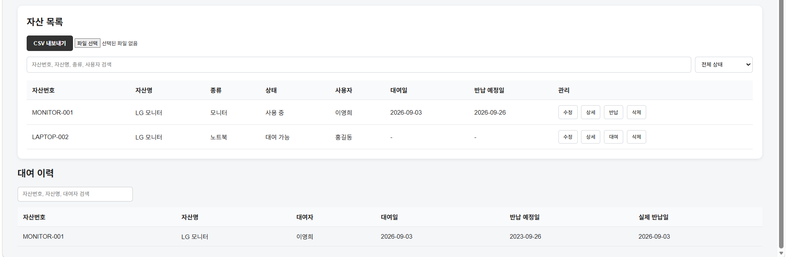


또한 대여 이력이 존재하는 자산을 삭제하기 전에

자산은 삭제되지만 대여 이력은 보존된다는 안내 메시지를 표시하도록 구현했습니다.

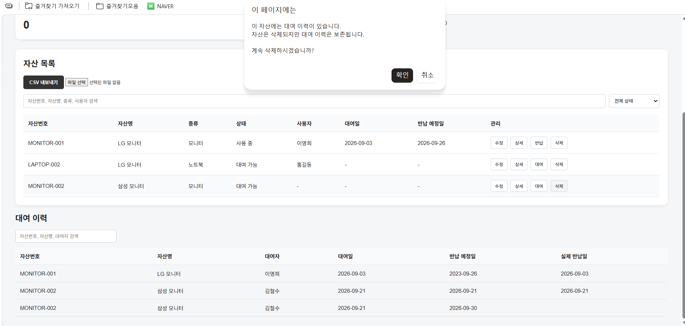


사용자가 삭제를 진행하면

자산 목록에서는 해당 자산이 제거되지만

기존 대여 이력은 그대로 유지됩니다.

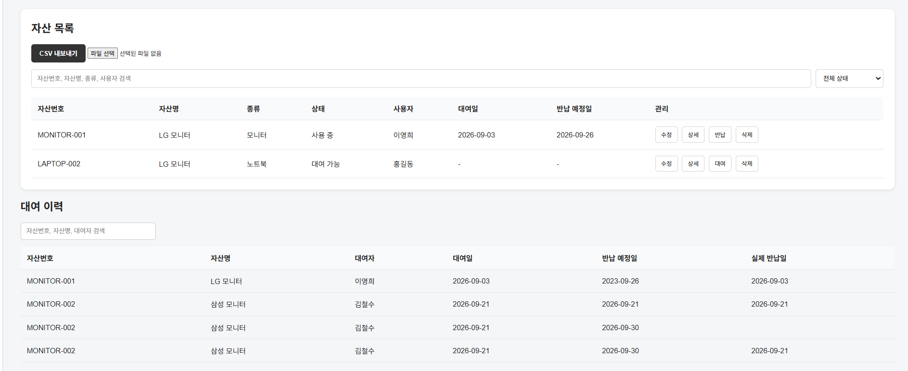


#### 3. 대여 및 반납 이력 관리 개선

자산을 대여할 때 대여자, 대여 날짜, 반납 예정일 등의 정보를

대여 이력에 즉시 저장하도록 개선했습니다.

이를 통해 자산을 대여한 직후에도

대여 이력 화면에서 해당 기록을 바로 확인할 수 있도록 구현했습니다.


또한 자산을 반납할 때 새로운 대여 이력을 생성하지 않고

기존 대여 이력을 찾아 실제 반납 날짜를 업데이트하도록 수정했습니다.

이를 통해 하나의 대여 건이 중복으로 기록되는 문제를 방지하고

대여부터 반납까지 하나의 이력으로 관리할 수 있도록 개선했습니다.

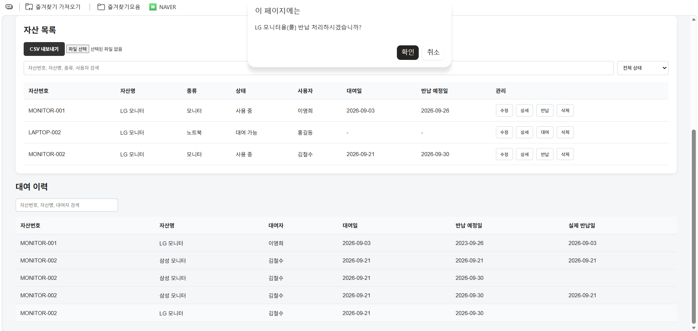


반납이 완료되면 자산의 상태가 `대여 가능`으로 변경되고

기존 대여 이력에는 실제 반납 날짜가 기록됩니다.

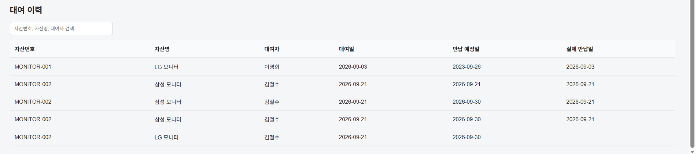


#### 구현 내용

- 대여 이력이 있는 자산 삭제 시 사용자 확인
- 자산 삭제 후 기존 대여 이력 보존
- 대여 시 대여 이력 즉시 생성
- 대여 이력 화면 즉시 갱신
- 반납 시 기존 대여 이력에 실제 반납 날짜 기록
- 반납 시 대여 이력 중복 생성 방지
- 자산 삭제 및 대여/반납 과정의 데이터 일관성 개선